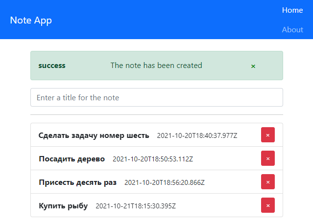

Использует **React**, **Axios**, **Firebase**. Содержит **Sass**. 

Реализует функционал записной книжки. 
Завершенный проект. 

-----

- [Маршрутизация](#Маршрутизация)
- [useContext](#useContext)
- [Firebase](#Firebase)
- [Базовые настройки](#Базовые-настройки)
- [Паттерны и лайфхаки](#Паттерны-и-лайфхаки)

# Маршрутизация

1. **Создаем компоненты, которые представляют страницы (Note, About)**
2. **Перечисляем в константах пути к ним:**

src/routes/constants.js

    export const HOME_ROUTE = `/home`;

3. **Описываем пути в виде массива объектов:**

src/routes/routes.js

    import {HOME_ROUTE} from './constants';
    import Home from '../pages/home/Note';

    export const publicRoutes = [
      {
        title: `home`,
        path: HOME_ROUTE,
        Component: Note,
      },
    ];

4. **Создаем компонент отвечающий за навигацию.**

Она позволит перемещаться между страницами при клике по указанному пункту. Используем NavLink. В отличии от простого Link, он позволяет воспользоваться стилизацией для выделения активной ссылки. NavLink включает в себя activeClassName (значение которого просто добавляется к стилизации) и/или activeStyle (используется в качестве встроенной стилизации, например activeStyle={{color: "green", fontWeight: "bold"}})

src/components/Navbar.jsx

    import React, {Fragment} from 'react';
    import {NavLink} from 'react-router-dom';
    import {publicRoutes} from '../routes/routes';

    const Navbar = () => {
      return (
        <ul className="navbar-nav">
          {publicRoutes.map(({title, path}) => (
            <li key={title} className="nav-item">
              <NavLink to={path} className="nav-link">{title}</NavLink>
            </li>
          ))}
        </ul>
      );
    };

    export default Navbar;

5. **Подключаем маршрутизацию.**

Switch итерируется по всем путям и в том случае, если ничего не найдено, возвращает последний маршрут. В нашем случае - Redirect. Это необходимо для того, чтобы пользователь, при неверном наборе пути, возвращался на HOME_ROUTE:

src/App.js

    import React from 'react';
    import {BrowserRouter, Switch, Route, Redirect} from "react-router-dom";
    import Navbar from './components/Navbar';
    import {HOME_ROUTE} from './routes/constants';
    import {publicRoutes} from './routes/routes';

    function App() {
      return (
        <BrowserRouter>
          <Navbar />
          

            <Switch>
              {publicRoutes.map(({title, path, Component}) => <Route key={title} path={path} component={Component} exact />)}
              <Redirect to={HOME_ROUTE} />
            </Switch>
          

        </BrowserRouter>
      );
    }

    export default App;

# useContext

Нам нужно, чтобы при каких-либо изменениях в Notes эти действия также отражались на Alert. Т.е. менялся текст, менялась видимость. Поэтому создадим хранилище, изменения стейта которого будут влиять на компонент Alert. Он будет содержать такие данные, как {visible, text, warning}. Посредством useContext сделаем его доступным для воздействия из любых компонентов.

1. **Создаем экшены**:

Перечисляем действия, которые будут воздействовать на стейт.

*src/context/alert/alertConstants.js*

    export const SHOW_ALERT = `SHOW_ALERT`;
    export const HIDE_ALERT = `HIDE_ALERT`;

2. **Создаем редьюсер**:

Отправляя действия в редьюсер, мы можем воздействовать на стейт определенным образом. Существует несколько паттернов создания редьюсера. В данном случае воспользуемся литералами объекта:

*src/context/alert/alertReducer.js*

    import {HIDE_ALERT, SHOW_ALERT} from "./alertConstants";

    const handlers = {
      [SHOW_ALERT]: (state, {payload}) => ({
        ...state,
        ...payload,
        visible: true,
      }),
      [HIDE_ALERT]: (state) => ({
        ...state,
        visible: false
      }),
      DEFAULT: state => state,
    };

    export const alertReducer = (state, action) => {
      const handle = handlers[action.type] || handlers.DEFAULT;
      return handle(state, action);
    };

3. **Извлекаем контекст**:

Именно этот инструмент предоставляет различным компонентам доступ указанному стейту

*src/context/alert/alertContext.js*

    import {createContext} from 'react';

    export const AlertContext = createContext();

4. **Соединяем стейт и редьюсер**:

Создаем компонент, который содержит 
- стейт 
- метод dispatch, который воздействует на стейт
- набор функции, которые оборачивают dispatch и производят необходимые действия

Данный компонент будет оборачивать все приложение. А в пропсы провайдера передаем и сам стейт и функции взаимодействия.

*src/context/alert/AlertState.js*

    import React, {useReducer} from 'react';
    import {HIDE_ALERT, SHOW_ALERT} from './alertConstants';
    import {AlertContext} from './alertContext';
    import {alertReducer} from './alertReducer';

    const initialState = {
      visible: false,
      text: ``,
      warning: ``,
    };

    export const AlertState = ({children}) => {
      const [state, dispatch] = useReducer(alertReducer, initialState);

      const show = (text, warning) => {
        dispatch({
          type: SHOW_ALERT,
          payload: {text, warning},
        });
      };

      const hide = () => dispatch({
        type: HIDE_ALERT,
      });

      return (
        <AlertContext.Provider value={{show, hide, alert: state}}>
          {children}
        </AlertContext.Provider>
      );
    };

5. **Оборачиваем все компоненты в AlertState**. 

Тем самым абсолютно любые компоненты имеют доступ к стейту Alert при использовании его контекста {show, hide, alert: state}.

*src/App.js*

    import React from 'react';
    import {BrowserRouter, Switch, Route, Redirect} from "react-router-dom";
    import {HOME_ROUTE} from './routes/constants';
    import {publicRoutes} from './routes/routes';
    import {AlertState} from './context/alert/AlertState';
    import Navbar from './components/Navbar';
    import Alert from './components/Alert';

    function App() {
      return (
        <AlertState>
          <BrowserRouter>
            <Navbar />
            

              <Alert />
              <Switch>
                {publicRoutes.map(({title, path, Component}) => <Route key={title} path={path} component={Component} exact />)}
                <Redirect to={HOME_ROUTE} />
              </Switch>
            

          </BrowserRouter>
        </AlertState>
      );
    }

    export default App;

6. **Использование контекста в компонентах**. 

Все, что нужно теперь для извлечения стейта, это использовать const {alert, hide, show} = useContext(AlertContext)

*src/components/Alert.jsx*

    import React, {useContext} from 'react';
    import {AlertContext} from '../context/alert/alertContext';

    const Alert = () => {

      const {alert, hide} = useContext(AlertContext);

      if (!alert.visible) {
        return null;
      }

      return (
        

          <strong>{alert.warning}</strong>
          {alert.text}
          <button type="button" className="close" onClick={hide}>
            &times;
          </button>
        

      );
    };

    export default Alert;

# Firebase

Нам нужно, чтобы при каких-либо изменениях в компонентах, эти действия также отражались на некоем внутреннем хранилище, которое, в свою очередь, будет консистентно по отношению к firebase и на основании которого будут отрисовываться компоненты. Т.е. будет динамически меняться массив записок. Посредством useContext сделаем его доступным для воздействия из любых компонентов.

Часть процесса повторяет создававшийся выше useContext. 

1. **Создаем экшены**:

Перечисляем действия, которые будут воздействовать на стейт.

src/context/firebaseConstants.js

    export const SHOW_LOADER = 'SHOW_LOADER';
    export const ADD_NOTE = 'ADD_NOTE';
    export const FETCH_NOTES = 'FETCH_NOTES';
    export const REMOVE_NOTE = 'REMOVE_NOTE';

2. **Создаем редьюсер**:

Отправляя действия в редьюсер, мы можем воздействовать на стейт определенным образом. Существует несколько паттернов создания редьюсера. В данном случае воспользуемся литералами объекта:

    *src/context/firebase/firebaseReducer.js*

    import {ADD_NOTE, FETCH_NOTES, REMOVE_NOTE, SHOW_LOADER} from "./firebaseConstants";

    const handlers = {
      [SHOW_LOADER]: (state) => ({
        ...state, loading: true
      }),
      [ADD_NOTE]: (state, {payload}) => ({
        ...state, notes: [...state.notes, payload]
      }),
      [FETCH_NOTES]: (state, {payload}) => ({
        ...state, notes: payload, loading: false
      }),
      [REMOVE_NOTE]: (state, {payload}) => ({
        ...state, notes: state.notes.filter(note => note.id !== payload)
      }),
      DEFAULT: state => state,
    };

    export const firebaseReducer = (state, action) => {
      const handle = handlers[action.type] || handlers.DEFAULT;
      return handle(state, action);
    };

3. **Извлекаем контекст**:

Это обычная переменная, которую используем как реакт-компонент

*src/context/firebase/firebaseContext.js*

    import {createContext} from 'react'

    export const FirebaseContext = createContext();

4. **Создаем проект на сайте firebase**

На официальном сайте создаем проект, производим первоначальные настройки (даем наименование), далее переходим в раздел Realtime Database, указываем, что операции будем проводить в тестовом режиме, в закладке "Данные" копируем ссылку на проект. 

5. Axios

Теперь разберем, какие операции запросов на сервер нам нужны. Учтем, что все запросы асинхронные, а значит действуют в рамках логики async - await. На предыдущем этапе мы уже скопировали ссылку на проект в firebase - она и станет нашим путем при запросе к серверу. Создаем [переменную окружения](#-Паттерны-и-лайфхаки), а после - извлекаем ее в переменную url.

Все асинхронные запросы состоят из двух процессов: сохранении в firebase и, в случае успешного завершения операции, сохранении данных в стейт нашего объекта Firebase посредством dispatch. При таком подходе, данные на удаленном сервере и в хранилище будут консистентными.

Сохраняем запись:

    const addNote = async (title) => {
      const note = {
        title,
        date: new Date().toJSON(),
      };

      try {
        const res = await axios.post(`${url}/notes.json`, note);

        const payload = {
          ...note,
          id: res.data.name
        };

        dispatch({type: ADD_NOTE, payload});

      } catch (error) {
        throw new Error(error.message);
      }
    };

Аналогично мы можем удалить запись:

    const removeNote = async (id) => {
      await axios.delete(`${url}/notes/${id}.json`);

      dispatch({
        type: REMOVE_NOTE,
        payload: id,
      });
    };

Аналогично мы можем извлечь сохраненные записи:

    const fetchNotes = async () => {
      dispatch({type: SHOW_LOADER});

      const res = await axios.get(`${url}/notes.json`);

      const payload = Object.keys(res.data || {}).map(key => {
        return {
          ...res.data[key],
          id: key,
        };
      });

      dispatch({type: FETCH_NOTES, payload});
    };

5. **Создаем компонент хранилища**:

Создаем компонент, который содержит 
- стейт 
- метод dispatch, который воздействует на стейт
- набор функции, которые оборачивают dispatch и производят необходимые действия

Данный компонент будет оборачивать все приложение. А в пропсы провайдера передаем и сам стейт и функции взаимодействия.

Асинхронные функции помещаем в соответствующие строки с троеточием.

*src/context/firebase/FirebaseState.js*

    import React, {useReducer} from 'react';
    import axios from 'axios';
    import {ADD_NOTE, FETCH_NOTES, REMOVE_NOTE, SHOW_LOADER} from './firebaseConstants';
    import {FirebaseContext} from './firebaseContext';
    import {firebaseReducer} from './firebaseReducer';

    const url = process.env.REACT_APP_DB_URL;

    const initialState = {
      notes: [],
      loading: false,
    };

    export const FirebaseState = ({children}) => {

      const [state, dispatch] = useReducer(firebaseReducer, initialState);

      const fetchNotes = async () => {...};

      const addNote = async (title) => {...};

      const removeNote = async (id) => {...};

      return (
        <FirebaseContext.Provider value={{
          fetchNotes,
          addNote,
          removeNote,
          loading: state.loading,
          notes: state.notes,
        }}>
          {children}
        </FirebaseContext.Provider>
      );
    };

6. **Оборачиваем все компоненты в FirebaseState**. 

Тем самым абсолютно любые компоненты имеют доступ к стейту Firebase при использовании его контекста {showLoader, fetchNotes, addNote, removeNote, loading: state.loading, notes: state.notes}

*src/App.js*

    import React from 'react';
    import {BrowserRouter, Switch, Route, Redirect} from "react-router-dom";
    import {HOME_ROUTE} from './routes/constants';
    import {publicRoutes} from './routes/routes';
    import {AlertState} from './context/alert/AlertState';
    import {FirebaseState} from './context/firebase/FirebaseState';

    function App() {
      return (
        <FirebaseState>
          <AlertState>
            <BrowserRouter>
              <Switch>
                {publicRoutes.map(({title, path, Component}) => <Route key={title} path={path} component={Component} exact />)}
                <Redirect to={HOME_ROUTE} />
              </Switch>
            </BrowserRouter>
          </AlertState>
        </FirebaseState>
      );
    }

    export default App;

7. **Взаимодействие компонентов с удаленным сервером**:

Хранилище настроено, удаленный сервер получает запросы. Осталось только сделать так, чтобы в ответ на наши действия, все необходимые данные менялись и в соответствии с этим менялся внешний вид компонентов.

Все, что нужно теперь для извлечения стейта, это использовать const {showLoader, fetchNotes, addNote, removeNote, loading, notes} = useContext(FirebaseContext) в нужных файлах.

Для отрисовки данных с сервера:

*src/pages/home/Home.jsx*

    import React, {useContext, useState} from 'react';
    import {AlertContext} from '../context/alert/alertContext';
    import {FirebaseContext} from '../context/firebase/firebaseContext';

    const Form = () => {

      const [value, setValue] = useState('');
      const alert = useContext(AlertContext);
      const firebase = useContext(FirebaseContext);

      const handleSubmit = (evt) => {
        evt.preventDefault();

        if (value.trim()) {
          firebase.addNote(value.trim())
            .then(() => alert.show(`The note has been created`, `success`))
            .then(() => setValue(``))
            .catch((error) => alert.show(`Error: ${error}`, `danger`));
        } else {
          alert.show(`Enter a title for the note`, `warning`);
        }
      };

      return (
        <form onSubmit={handleSubmit}>
          

            <input
              type="text"
              className="form-control"
              placeholder="Enter a title for the note"
              value={value}
              onChange={({target}) => setValue(target.value)} />
          

        </form>
      );
    };

    export default Form;

# Deploy

Пришло время для развертывания приложения на сервер. Вначале соберем продакшн версию проекта

    yarn run build

В ответ на данное действие появится папка build с минифицированным кодом.

Переходим на сайт firebase → Hosting → Get Started, где указано, что необходимо глобально установить:

    npm install -g firebase-tools

На следующем шаге потребуется ввести

    firebase login

Или, если уже залогинились:

    firebase login --interactive

# Базовые настройки

Если ещё не установлен yarn:

    npm i -g yarn

Создаем проект:

    npx create-react-app notes-firestore

Переходим в сам проект через cd notes-firestore и устанавливаем зависимости:

    yarn add node-sass react-router-dom axios bootstrap

Настраиваем линтер (сам eslint уже установлен вместе с create-react-app):

    yarn add eslint-plugin-babel eslint-plugin-react --dev

Создаем обслуживающие функционал:

    touch .editorconfig .eslintrc.json .gitattributes

Наполняем editorconfig:

    root = true

    [*]
    charset = utf-8
    end_of_line = lf
    indent_size = 2
    indent_style = space
    insert_final_newline = true
    trim_trailing_whitespace = true

    [*.md]
    trim_trailing_whitespace = false

Наполняем eslintrc:

    {
      "env": {
        "browser": true,
        "commonjs": true,
        "es6": true,
        "node": true
      },
      "extends": ["eslint:recommended",
        "plugin:react/recommended"],
        "parserOptions": {
          "ecmaFeatures": {
            "jsx": true
      },
          "ecmaVersion": 2018,
          "sourceType": "module"
      },
      "plugins": [
          "react",
          "babel"
      ],
      "rules": {
          "no-unused-vars": ["error", { "caughtErrorsIgnorePattern": "^ignore" }],
          "react/jsx-uses-react": 1,
          "react/jsx-uses-vars": "error",

          "linebreak-style": [
          "error",
          "unix"
      ],
          "babel/new-cap": 1,
          "babel/camelcase": 1,
          "babel/no-invalid-this": 1,
          "babel/object-curly-spacing": 1,
            "babel/semi": 1,
          "babel/no-unused-expressions": 1,
          "babel/valid-typeof": 1
      }
    }

Наполняем gitattributes:

    * text=auto
    *.doc     diff=astextplain
    *.DOC     diff=astextplain
    *.docx    diff=astextplain
    *.DOCX    diff=astextplain
    *.dot     diff=astextplain
    *.DOT     diff=astextplain
    *.pdf     diff=astextplain
    *.PDF     diff=astextplain
    *.rtf     diff=astextplain
    *.RTF     diff=astextplain
    *.md text
    *.tex text
    *.adoc text
    *.textile text
    *.mustache text
    *.csv text
    *.tab text
    *.tsv text
    *.sql text
    *.png binary
    *.jpg binary
    *.jpeg binary
    *.gif binary
    *.tif binary
    *.tiff binary
    *.ico binary
    *.svg binary
    #*.svg text
    *.eps binary

    .gitattributes export-ignore
    .gitignore export-ignore

Для того, чтобы использовать препроцессор, меняем расширение index.css и перемещаем в папку src/assets/sass/index.scss. А для того, чтобы подключить туда же bootstrap, помещаем вверх этого файла:

    @import "~bootstrap/scss/bootstrap";

Часто при установке sass возникает ошибка версий. В этом случае:

    yarn remove node-sass 
    yarn add node-sass@4.14.1

Удаляем из предустановленного проекта App.css App.test.js logo.svg reportWebVitalis.js. Удаляем сопутствующие импорты.

Настраиваем порт в package.json:

    "start": "set port=3013 && react-scripts start",

Запускаем проект:

    yarn run start

Если проект успешно скомпилировался, создаем репозиторий на gitHub и копируем его на компьютер, введя после нижеприведенной команды адрес, который скопировали из удаленного репозитория:

    git remote add origin

Сохраняем все изменения в удаленный репозиторий на github, привязываясь к нему:

    git add -A
    git commit -m
    git push -u origin master

Все последующие изменения можно будет вносить командой:

    git add -A
    git commit -m
    git push

# Паттерны и лайфхаки

Переменные окружения, такие, например, как путь до проекта на сервере firebase можно сохранить в файле .env.local. Сам файл должен быть указан в gitignore т.к. в нем можно содержать в том числе и пароли. Данный подход можно использовать только для этапа разработки:

    REACT_APP_DB_URL=https://firebasedatabase.app

После - необходимо перекомпилировать проект и теперь можно извлечь переменную, используя объект process:

    const proc = process.env.REACT_APP_DB_URL;

    console.log(proc);

Сгенерировать массив с фейковыми данными:

    const notes = new Array(3)
    .fill(``)
    .map((_, i) => (
      {
        id: i, 
        title: `Note ${i + 1}`
      })
    );
